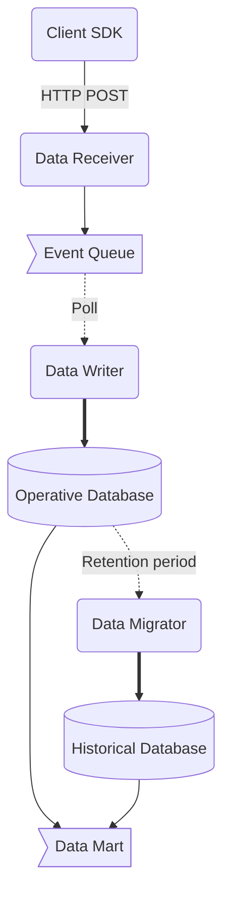

# AnalyticsPipeline

## Summary

As organizations increasingly rely on data-driven insights, creating a robust analytics system becomes paramount.
My project aims to deliver an opinionated approach to building such a system, combining efficiency, scalability, and practicality.
Let’s dive into the key aspects:

### Objective and Scope:

- Analytics system serves as a bridge between raw data and actionable insights. It empowers decision-makers by providing real-time and historical data analysis.
- That system focus on a medium-scale solution, striking a balance between agility and depth.

### Components:

- **Client-Side SDK**: our SDK facilitates seamless data collection from various sources (Unity game engine: standalone, web, mobile apps). It ensures minimal impact on user experience while capturing essential events.
- **Operative and Historical Data Storage:**
  - **Operative Data:** real-time data storage for immediate processing. Minimal latency, but limited volume / time range.
  - **Historical Data:** long-term storage for trend analysis, reporting, and compliance. Enables retrospective insights and predictive modeling. Full data retention, but higher latency.
  - **Data mart** - both data storages allows to query data using SQL and set up useful views for business users.

### Technology Stack:

I’ve chosen the .NET ecosystem for several reasons:
- **Unity Game Developers:** .NET is familiar to Unity developers, allowing seamless transitions between game development and analytics.
- **Language Consistency:** Using C# for both client and server-side development streamlines code maintenance and collaboration.
- **Rich Libraries:** Leverage .NET libraries for data manipulation, security, and scalability.

### Business Impact:

That analytics system empowers stakeholders to:
- Optimize user experiences based on real-time data.
- Identify bottlenecks, anomalies, and growth opportunities.
- Make informed decisions backed by historical trends.
- Enhance operational efficiency and resource allocation.

In summary, my opinionated analytics system combines technical excellence with practicality, enabling data-driven success.
Let’s turn insights into action! 🚀📊

## Abstract architecture

